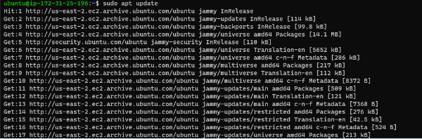
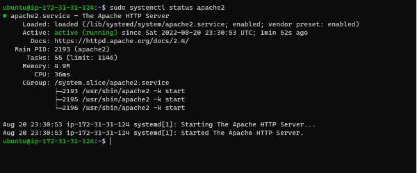
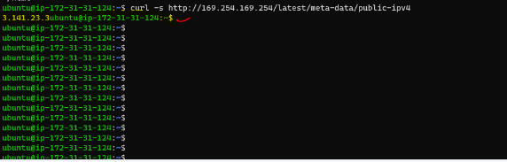

## Step1 

## Installing Apache and updating firewall

`sudo apt update`

`sudo apt install apache2`

`sudo systemctl status apache2`

`curl -s http://169.254.169.254/latest/meta-data/public-ipv4`

`http://3.141.23.3:80`

## Step2  

## Installing mysql

`sudo apt install mysql-server`

`sudo mysql`

`ALTER USER 'root'@'localhost' IDENTIFIED WITH mysql_native_password BY 'PassWord.1';`

`mysql> exit`

`sudo mysql_secure_installation`

`mysql> exit`

## Step 3

## INSTALLING PHP

`sudo apt install php libapache2-mod-php php-mysql`

`php -v`

## Step 4

##  CREATING A VIRTUAL HOST FOR YOUR WEBSITE USING APACHE

`sudo mkdir /var/www/projectlamp`

 `sudo chown -R $USER:$USER /var/www/projectlamp`
 

 `sudo vi /etc/apache2/sites-available/projectlamp.conf`
 

 `sudo ls /etc/apache2/sites-available`
 

 `sudo a2ensite projectlamp`
  

  `sudo apache2ctl configtest`
  

  `sudo systemctl reload apache2`
   

   ## STEP 5 
   
   ##  ENABLE PHP ON THE WEBSITE

   `sudo vim /etc/apache2/mods-enabled/dir.conf`
   

   `sudo systemctl reload apache2`
   

   `vim /var/www/projectlamp/index.php`
   

   `sudo rm /var/www/projectlamp/index.php`
   

